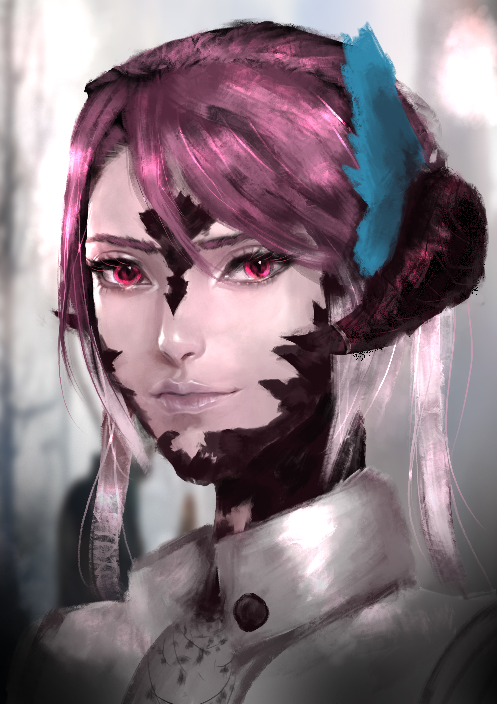

# Li Austrene

## Biography

### Info

* Name: Li Austrene
* Age: 25
* Orientation: Pansexual
* Gender: Female
* Race: Xaela
* Tribe: Haragin
* Skin Color: Pale with obsidian black scales
* Hair Color: Light pink with white tips
* Eye Color: Earthy Red with Lavender Limbal Rings
* Height: 60 Ilms
* Weight: 100 Pz
* Place of Origin: Coast of the Azim Steppe
* Occupation: Freelance Healer
* Scent: A faint Lavender

### Personality

To be completed at another time

### Appearance

To be completed at another time

## Her Story

[Story](story.md)

Li Haragin was a happy child, until a sickness passed through her tribe, her family falling ill. The trio was taken in by the tribe's healer, Austrene, who watched over them, paying particular attention to the small girl in her care. Li doesn't remember too much from this time, waxing and waning in and out of consciousness, but when she was awake she saw the comforting face of the Healer, and heard her telling Stories to help calm her. Li managed to survive the sickness, but her parents were not as lucky, leaving the small child orphaned to the tribe. The healer took her in full time, feeling guilt over not being able to do more, but for Li, life returned to a new normal. It was a normal of training in medicine, bugging Austrene to repeat the stories she had told, and dreaming about all the people of Hydaelyn sharing the same sky as her.

Li continued her training and became a strong healer in her own right, learning how to shape and manipulate aether to assist in her practice. Working as a pair, Li and Austrene served the Haragin well. One day, when Li was around 22 years old, and the sea was slightly more agitated than normal, Austrene went on a walk by herself. She had picked up this tradition a few years prior, a way to meditate and clear the mind. After a few hours she left and had still not returned, Li ran out, searching for her. She found her dead in the sand, a stray wave snapped her neck. The anguish that she could do nothing haunted her, but life continued until one day, absentmindedly lost in her work, she had turned to where Austrene should have been to ask her to remind her part of a story.

Li realized that all of the stories that lived inside Austrene's mind were never written down, lost to time, only sure of her broken memories of them. That night, she took a small bag and left her tribe, trying to find her way to Eorzea, the land of many of Austrene's stories, and see them for herself. To write down the stories of those she had met along the way, even the most mundane, so ensure they too wouldn't be lost.

She made it to Kugane, the port where she hoped she could find her way to Eorzea, but had no money, or idea how to get on a ship for that far a voyage. She found an offer that seemed too good to be true, and unfortunately it was. She had sold herself into indentured servitude to pay for the journey, almost two years of hard work and nights of staring through barred windows to light polluted skies.

But finally the chance came to make the voyage, to see Eorzea, and to collect the stories she so desperately wanted. Stepping foot in Limsa Lominsa, she decided then and there to change her name. She dropped her tribal surname, replacing it after the name of her mentor, to honor the woman that played such an important part of her life. She became Li Austrene.

## RP Hooks

### Doctor
Li is a trained healer, with a soft spot for anyone in need. If a character is suffering from a wound or ailment, physical or magical, Li will be willing to help.

### Storyteller
Rumors have been spreading of a pink haired Xaela collecting stories of the people as she traveled Eorzea, giving stories away in exchange of one of their own. If you are looking for stories, or have an interesting one, you might seek her out.

### Tribal
Li is a Xaela from the Haragin tribe. If you are also from the steppes, you may have met her, or know her tribe.

### Kugane / Far East RP
Li spent some time in Kugane, and even if it was not the best, she did have some freedom. It's a large city, maybe you ran into her at a bar, or both happened to witness the same event. 

### Anything else!
I am up for just about any story, so feel free to suggest just about anything else

## Art

<figure>
        
        <figcaption>A portrait of Li by <a href="https://artistsnclients.com/people/Dean">Dean</a></figcaption>
</figure>

## OOC Notes

I am up for just about any kind of story, from Dark and Mature to cutesy and slice of life. My number one rule for RPing is to make sure everyone is a) comfortable and b) having a good time, so if anything in a scene is making you uncomfortable, please /tell me rather than try and force yourself through it.

### A Note on long term RP

I love long term rps, as I feel they really give a chance to tell an interesting story and lead to some cool development. To that end, long term rps will be mostly siloed off into their own version of Li, so that the stories can move at whatever pace they need to. This does mean that most of what happens in an active long term RP won't have a direct impact on Li, but events may be mentioned as having happened. It also allows for each individual version to go for more semi-permanent changes, so I feel the trade offs are worth it. 

### Lore Adherence

I am super up for bending the lore of the world for cool events, and making sure that characters can bring in whatever makes them special. Having said that, the majority of Li's character is based pretty strongly in normal ffxiv lore, with a few tweaks to the Haragin tribe since we know so little about them. Because of this, her (and my) default assumption is that this is the world we are operating in, and will continue to think that unless it is otherwise shown or told to her.

### Contact

Feel free to reach out to *Li Austrene* on Zalera, in the crystal datacenter. 

<!-- Li is no stranger to loss, but rather than let that keep her down, she let's the joy of the memories of the people that had been in her life inform her future.  -->